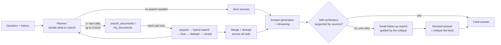
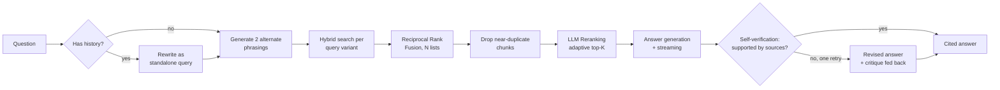

<p align="center">
  
</p>

<p align="center">
  
  
  = 18" />
  
  
</p>

# Agentic RAG Assistant

A full-stack retrieval-augmented generation system where every answer traces back to its exact source. Built to go beyond a basic "embed and search" wrapper — a tool-calling agent that decides for itself whether/how many times to search, hybrid retrieval with reranking underneath it, and self-verification with visible corrections, wrapped in a real product UI with live streaming, verifiable citations, and a per-query pipeline inspector.

**Stack:** Node.js/Express · React (Vite) · TypeScript · Groq · Jina AI · Pinecone · Supabase

<details>
<summary><strong>Table of contents</strong></summary>

- [Why this isn't just another RAG demo](#why-this-isnt-just-another-rag-demo)
- [Screenshots](#screenshots)
- [Architecture](#architecture)
- [Key Features](#key-features)
- [Tech Stack](#tech-stack)
- [Project Structure](#project-structure)
- [Getting Started](#getting-started)
- [Configuration](#configuration)
- [API Reference](#api-reference)
- [Testing](#testing)
- [Evaluation](#evaluation)
- [Deployment](#deployment)
- [Security](#security)
- [Known Limitations](#known-limitations)
- [Roadmap](#roadmap)
- [License](#license)

</details>

---

## Why this isn't just another RAG demo

Most RAG tutorials stop at "embed chunks, do a vector search, stuff into a prompt." That approach has a well-known failure mode: pure vector similarity misses exact matches (product names, numbers, specific phrases), there's no check on whether the retrieved chunks actually answer the question, and the pipeline runs the same fixed sequence whether the question needs one search or five. This project addresses all three directly:

- **Agentic retrieval** — a tool-calling planner decides for itself whether a question needs searching the documents at all, and how many times, instead of a fixed pipeline that always runs exactly one search. A comparison question gets one focused search per thing being compared; a greeting gets none; a question that needs refining gets a follow-up search - all decided by the model, not hardcoded. Falls back to the deterministic fixed pipeline automatically if planning itself fails (see [Architecture](#architecture))
- **Hybrid retrieval** — vector search (Pinecone) and keyword search (Postgres full-text) run in parallel and get fused with Reciprocal Rank Fusion, so a chunk that's a strong match on *either* signal surfaces correctly
- **Multi-query retrieval** — the query is expanded into a couple of alternate phrasings, each searched independently and fused together with everything else, so wording mismatches between the question and the document's vocabulary don't silently lose recall
- **LLM reranking** — a single batched call re-judges the fused, deduplicated candidates for genuine relevance, not just similarity score, before anything reaches the answering model
- **Query rewriting** — follow-up questions ("what about the second one?") get expanded into standalone queries using conversation history before retrieval runs (fixed pipeline only - the agentic planner already sees conversation history directly and resolves references itself when it writes a search query)
- **Self-verification** — after an answer is generated, a separate check asks whether it's actually supported by the cited sources. If not, one corrected revision streams in as a visible replacement, with the specific problem fed back into the prompt - and in agentic mode, a small follow-up search guided by that same critique, not just a reworded retry
- **Verifiable citations** — every claim in an answer links back to the exact source chunk, with the model's own citation graph reflected in the UI (used vs. merely-retrieved sources are shown separately)
- **Pipeline observability** — every answer carries a stage-by-stage trace, inspectable per-message in the UI, showing exactly what the pipeline (or the agent) actually did to produce it

## Screenshots

<!--
  Add real screenshots here before sharing this repo widely - a live shot
  of the chat view (with citations expanded) and the document/folder
  sidebar are the two most convincing. Drop PNGs in docs/screenshots/ and
  reference them like:
  <p align="center"></p>
-->

## Architecture

By default (`ENABLE_AGENTIC_MODE=true`), a tool-calling planner decides retrieval dynamically instead of running a fixed sequence:



If planning itself fails before anything is returned to the client, the request transparently falls back to the deterministic fixed pipeline below for that one query - it never surfaces an error to the person asking. Set `ENABLE_AGENTIC_MODE=false` to always use the fixed pipeline:



Both paths share the same retrieval engine (`runRetrieval` in `rag.js`: expand → hybrid search → fuse → dedupe → rerank) - the agentic planner just calls it once per search it decides to make, while the fixed pipeline always calls it exactly once. Both also share the same generation and self-verification code; only how the source chunks were gathered differs.

## Key Features

**Retrieval & answering**
- **Agentic retrieval planning** — a tool-calling model decides whether a question needs searching at all, and how many times, via two read-only tools (`search_documents`, `list_documents`) rather than a fixed one-search-per-question sequence. A multi-part comparison question gets one focused search per part; small talk gets none, without ever letting the model answer content questions from its own parametric knowledge (see `agenticRag.js`'s planner system prompt for the exact groundedness guarantee this relies on)
- Structure-aware document chunking (markdown-header-aware, word-window fallback for plain text/PDF), with chunk boundaries snapped to the nearest sentence ending instead of cutting strictly mid-sentence
- Multi-query retrieval — the query is expanded into alternate phrasings that each run hybrid search independently, all fused together with RRF (which fuses N ranked lists, not just two), so wording that doesn't match the document's exact vocabulary still has other angles to land on
- Near-duplicate chunk removal before reranking (cheap word-overlap check, no extra API calls) — keeps the reranker's limited candidate budget from being spent on repeat passages, which multi-query retrieval makes more likely, and runs again to merge results across multiple agentic search calls
- Adaptive top-K — broad questions ("summarize", "compare X and Y", "give me an overview") automatically pull more source chunks than narrow factual ones, via a zero-latency keyword heuristic
- Hybrid search fused with RRF, LLM reranking with a rescue safety net for broad/overview questions
- Self-verification runs as a background check, never a blocking one — the first answer is shown as final immediately, and a check afterward either silently confirms it or offers a corrected version as a dismissible suggestion (never an automatic rewrite of something already on screen). In agentic mode, a failed check also triggers one small follow-up search guided by the specific critique, not just a reworded retry
- Generation prompt tuned for per-claim citation density and cross-source synthesis, not just source-by-source restatement
- Streaming responses via Server-Sent Events — answers appear token-by-token
- Cross-family model fallback (generation/utility calls automatically retry on a different model family if the primary is decommissioned - see `modelFallback.js`), plus a separate provider-level fallback (Mistral) if Groq itself is unreachable, not just a single model. Agentic planning failures fall back to the deterministic fixed pipeline automatically, transparent to the person asking
- A golden-set evaluation harness (`npm run eval`) scoring retrieval precision, answer faithfulness (LLM-as-judge), and abstention accuracy against a fictional document designed so the model can't cheat with training-data knowledge - runs unchanged against either retrieval mode, since it talks to the HTTP API, not the internals
- **Pipeline observability** — every answer carries a stage-by-stage trace built from data the pipeline already produces, at no extra API cost. Fixed-pipeline traces show rewrite → expansion → retrieval → dedup → rerank → generation → verification; agentic traces show the planner's actual tool calls (which queries it chose, how many passages each found) in place of the fixed sequence. Inspectable per-message in the UI (see below), not just in server logs

**Conversations**
- Multi-turn memory backed by Supabase, with auto-titled threads
- Per-conversation document scoping — pick exactly which uploaded document(s) a thread searches
- Export any conversation to a clean, portable Markdown file (with citations and verification notes preserved)
- Filter conversations by title (search box appears once there are enough to be worth filtering)

**Documents**
- Organize documents into folders, or leave them uncategorized — folders are a pure organizational layer, deleting one never deletes the documents inside it
- Filter documents by filename or by folder

**Answer formatting**
- The generation prompt actively asks for structure that matches the content's shape — markdown tables for comparisons/structured data, bulleted lists for enumerable items, numbered lists only when order matters, bold for scannable key terms, headers for genuinely multi-part answers, code blocks for code/commands/config — and explicitly avoids forcing structure onto a simple one-fact answer that's better as a sentence
- A lightweight regex hint (`formatHint` in `llm.js`) nudges toward the single most likely structure for comparison-, steps-, and list-shaped questions specifically, at zero extra latency or cost, layered on top of the model's own judgment rather than replacing it
- Sparingly, for content that describes an actual process, sequence, or architecture, the model can emit a Mermaid diagram using a fenced `mermaid` code block, rendered client-side as a real diagram — lazy-loaded so its bundle cost is paid only by conversations that actually contain one, with a plain-code-block fallback if a diagram ever fails to render rather than breaking the message
- All of this renders through the same citation-aware pipeline as plain prose — a "(Source 1)" citation works identically inside a table cell, list item, or paragraph

**Citations**
- Inline citation badges that expand into source cards (excerpt, full text, relevance score, chunk index)
- Distinguishes sources the model actually cited from ones merely retrieved
- A "Pipeline Trace" inspector on every answer — a vertical timeline of every stage the pipeline ran, with per-stage timing, a proportional duration bar, and stage-specific detail (the rewritten query, generated variants, retrieval hit counts, which candidates the reranker kept vs. dropped, the self-verification verdict) — turns the architecture diagram above into something you can click into per-query instead of only reading in server logs

**Frontend**
- Two design systems, deliberately kept separate: the landing page runs on "Ledger" — a research-ledger/evidence-desk aesthetic (cool sage paper tones, verdigris + rust-sienna dual accents, Newsreader serif + Public Sans + JetBrains Mono), full light/dark theming with zero flash on load. The main app view runs on "Signal" — a precision instrument-panel aesthetic built around the same core idea RAG retrieval itself is doing (finding signal in noisy candidates): a deep blue-black base, a phosphor-cyan/warm-amber dual accent, Instrument Serif + Hanken Grotesk, and a live waveform motif that recurs across the empty state, loading indicators, and composer. Both are built deliberately away from the cream-and-one-accent or near-black-and-acid-green look most AI-generated UIs default to. See `client/src/index.css`'s `.signal-theme` block for the full token set and the reasoning behind the split.
- "The Array" — a Hero-only 3D background (`client/src/components/hero/signal-field/`) visualizing retrieval itself: an oscilloscope-grid terrain and a field of dim "document" particles that periodically cluster, brighten, and connect via beams before fading - an ambient, ongoing depiction of finding signal in noise. Built on react-three-fiber with only standard Three.js materials (no custom GLSL, deliberately - shader compile failures don't throw catchable JS errors, so avoiding them entirely was the safer call for something this couldn't be visually iterated on in every environment). Colors are read live from Ledger's own `--accent`/`--highlight` CSS variables, so it follows the existing light/dark toggle rather than hardcoding its own palette. Lazy-loaded into its own chunk, and falls back to a plain 2D gradient orb under `prefers-reduced-motion`, missing WebGL, a hidden tab, or any runtime error (see `SignalBackground.tsx`/`SceneErrorBoundary.tsx`).
- Citation badges styled as archive stamps (a signature element tied directly to the product's actual mechanic, not decoration) with spring-physics entrance animation
- Command palette (Cmd/Ctrl+K) for quick navigation and conversation search, with staggered result entrance
- Ambient animated background, staggered list/message entrance, page-transition choreography throughout via Framer Motion — all respecting `prefers-reduced-motion`
- Code-split so the landing page ships independently from the app shell (~108KB gzipped initial load vs. ~190KB before splitting)
- Fully responsive, including a proper mobile drawer sidebar

## Tech Stack

| Layer | Technology |
|---|---|
| Backend | Node.js, Express |
| Frontend | React, Vite, TypeScript, Tailwind CSS, Framer Motion, `react-markdown` + `remark-gfm`, Mermaid (lazy-loaded, diagrams only) |
| Testing | Vitest + React Testing Library (frontend), standalone Node scripts (backend) |
| LLM | Groq (generation + reranking/rewriting/verification), Mistral AI (optional provider-level fallback) |
| Embeddings | Jina AI (`jina-embeddings-v3`) |
| Vector store | Pinecone |
| Database | Supabase (Postgres) — documents, conversations, messages, full-text search index |
| UI primitives | Radix UI, `cmdk` |

## Project Structure

```
agentic-rag-assistant/
├── server/
│   ├── src/
│   │   ├── routes/       # documents, folders, query, conversations (SSE streaming)
│   │   ├── services/     # chunking, embeddings, retrieval pipeline, reranking,
│   │   │                 # query rewriting, self-verification, RRF fusion, model resilience
│   │   ├── db/           # Supabase-backed stores (documents, folders, conversations, chunks)
│   │   ├── workers/      # async ingestion pipeline
│   │   ├── utils/        # standalone test suites for pure/testable logic
│   │   ├── app.js        # builds the Express app (no side effects - safe to import in tests)
│   │   └── server.js     # actual boot entry point (app.js + app.listen())
│   ├── test/              # HTTP-level route tests (Express + supertest, DB layer mocked)
│   ├── eval/              # RAG evaluation harness (golden document + question set)
│   └── supabase/         # SQL schema + migrations
└── client/
    └── src/
        ├── components/   # chat, citations, documents, conversations, command palette
        ├── context/      # theme, documents, conversations state
        ├── lib/          # API client (incl. SSE streaming), types, export/citation logic
        └── test/         # Vitest unit + component tests
```

## Getting Started

### Prerequisites
Free-tier accounts for [Groq](https://console.groq.com/keys) (no credit card required), [Jina AI](https://jina.ai/embeddings/), [Pinecone](https://app.pinecone.io), and [Supabase](https://supabase.com) — no paid tier required anywhere.

### 1. Supabase setup
Run `server/supabase/schema.sql`, then `server/supabase/migration_002_hybrid_search.sql`, then `server/supabase/migration_003_self_verification.sql`, then `server/supabase/migration_004_document_folders.sql`, then `server/supabase/migration_005_pipeline_trace.sql`, then `server/supabase/migration_006_document_content_hash.sql`, then `server/supabase/migration_007_users_and_ownership.sql` in the Supabase SQL Editor.

### 2. Pinecone setup
Create an index named to match `PINECONE_INDEX_NAME`, with **dimension 768** and **cosine** metric.

### 3. Backend
```bash
cd server
npm install
cp .env.example .env   # fill in your API keys
npm start
```
Runs on `http://localhost:5000`.

### 4. Frontend
```bash
cd client
npm install
npm run dev
```
Open the printed local URL. The dev server proxies `/api/*` to the backend — no frontend env vars needed.

> **Both at once (optional):** from the repo root, `npm run install:all` then `npm run dev` starts both server and client together in one terminal (color-coded output), using [`concurrently`](https://www.npmjs.com/package/concurrently). This is purely a convenience wrapper around steps 3-4 above — it still needs `server/.env` filled in first.
>
> **`ECONNREFUSED` / `http proxy error` in the client's terminal** almost always means the backend simply isn't running yet — the two dev servers are separate processes and the frontend's Vite proxy (see `client/vite.config.ts`) can't reach `localhost:5000` until `cd server && npm start` (or the combined `npm run dev` above) is actually up. Check that terminal for its own startup message/errors before assuming anything else is wrong.

## Configuration

All configuration lives in `server/.env` (see `.env.example` for the full list with defaults). Notable ones:

| Variable | Purpose |
|---|---|
| `GROQ_API_KEY` | Single shared key for generation/reranking/rewriting/verification — Groq rate-limits per organization, not per key, so there's no benefit to splitting this |
| `JINA_API_KEY` | Embeddings key — kept on a separate provider from Groq since Groq doesn't have a reliably documented embeddings API |
| `MISTRAL_API_KEY` | Optional provider-level fallback if Groq is entirely unreachable — unset simply skips this, no code changes needed |
| `ENABLE_HYBRID_SEARCH`, `ENABLE_RERANKING`, `ENABLE_QUERY_REWRITE`, `ENABLE_QUERY_EXPANSION`, `ENABLE_DEDUPLICATION`, `ENABLE_ADAPTIVE_TOPK`, `ENABLE_SELF_VERIFICATION`, `ENABLE_PIPELINE_TRACE` | Toggle any pipeline stage independently, no code changes needed |
| `ENABLE_AGENTIC_MODE` | Use the tool-calling planner instead of the fixed pipeline (default `true`). Falls back to the fixed pipeline automatically for a request if planning itself fails |
| `AGENTIC_MAX_STEPS` | Max planner round-trips per question (default `3`) - a single round-trip can still request multiple parallel searches |
| `AGENTIC_PLANNER_MODEL`, `AGENTIC_PLANNER_MODEL_FALLBACK` | Model used for retrieval planning - defaults to `UTILITY_MODEL`, independently overridable |
| `ENABLE_AGENTIC_RESEARCH_ON_REVISION` | On a self-verification failure in agentic mode, run one small extra search guided by the critique before revising (default `false` - adds real latency to the background step for a correction a plain reword usually achieves anyway; opt in if you want it) |
| `BACKGROUND_VERIFICATION_TIMEOUT_MS` | Hard cap on how long the background verification/revision step is allowed to run before being abandoned (default `20000`) - the visible answer is unaffected either way if this fires |
| `ENABLE_FORMAT_HINTS` | Nudge toward a table/numbered-list/bulleted-list for comparison/steps/enumerable-shaped questions specifically (default `true`) |
| `QUERY_EXPANSION_COUNT` | How many alternate phrasings to generate for multi-query retrieval (0 disables it) |
| `DEDUP_SIMILARITY_THRESHOLD` | Word-overlap threshold above which two candidate chunks are treated as near-duplicates |
| `ADAPTIVE_TOPK_BONUS` | Extra chunks retrieved for broad/summary-style questions on top of `RETRIEVAL_TOP_K` |
| `RETRIEVAL_TOP_K`, `RETRIEVAL_CANDIDATE_POOL` | Tune how many chunks are considered vs. sent to the model |
| `GENERATION_MODEL_FALLBACK`, `UTILITY_MODEL_FALLBACK` | Automatic fallback models if a primary model is deprecated/unavailable |

## API Reference

| Endpoint | Method | Description |
|---|---|---|
| `/api/documents/upload` | POST | Upload a document (`.txt`/`.md`/`.pdf`/`.docx`), returns immediately with async processing status. Optional `folderId` form field |
| `/api/documents/:id/status` | GET | Poll ingestion status |
| `/api/documents` | GET | List all documents. Optional `?folderId=<id>` or `?folderId=none` filter |
| `/api/documents/:id` | DELETE | Remove a document and its vectors |
| `/api/documents/:id/folder` | PATCH | Move a document to a folder (or `{folderId: null}` to uncategorize) |
| `/api/folders` | GET/POST | List or create folders |
| `/api/folders/:id` | DELETE | Delete a folder (documents inside become uncategorized, not deleted) |
| `/api/query` | POST | Stateless Q&A, streamed via SSE |
| `/api/conversations` | POST/GET | Create or list conversation threads |
| `/api/conversations/:id` | GET/DELETE | Fetch or delete a thread |
| `/api/conversations/:id/messages` | POST | Ask a question in a thread, streamed via SSE. The `done` event is the final answer; `verified` and `revision_available` events may follow later on the same connection as self-verification finishes in the background (see Key Features above) |
| `/api/conversations/:id/messages/:messageId/revision` | PATCH | Accept a suggested revision from a `revision_available` event as the message's new content - the one point a suggestion is actually written anywhere |
| `/health` | GET | Service status, configured providers, and active pipeline configuration |

## Testing

Every push and PR to `main` runs the full suite below via [GitHub Actions](.github/workflows/ci.yml) — backend and frontend jobs in parallel, no secrets required (see why in the workflow file's comments). To run the same checks locally:

The backend includes standalone test suites for all pure/testable logic — no API keys required to run:

```bash
cd server
npm run test:chunking      # chunking strategy correctness, incl. sentence-boundary snapping
npm run test:rrf           # Reciprocal Rank Fusion logic
npm run test:reranker      # reranker response parsing, including malformed model output
npm run test:citations     # citation extraction from answer text
npm run test:modelfallback # model deprecation fallback behavior
npm run test:verification  # self-verification response parsing, fail-open behavior
npm run test:prompt        # prompt construction, with/without conversation history
npm run test:dedup         # near-duplicate chunk removal
npm run test:queryexpansion # multi-query expansion response parsing
npm run test:adaptive-topk # broad-vs-narrow question topK classification
npm run test:tracebuilder  # pipeline trace formatting, incl. no_info/rescue/disabled-stage shapes, both fixed and agentic shapes
npm run test:agenttools    # tool schema validity, document-scope filtering
npm run test:agenticplanner # planner system prompt content, tool-argument parsing
npm run test:embeddings    # concurrency limiter + 429 retry/backoff (real fetch mocked, no live Jina key needed)
npm run test:textextraction # PDF error-message translation, timeout wrapper config
npm run test:ingestion     # embedding sub-batch splitting for large documents
```

The agentic planner's actual tool-calling LOOP (deciding what to search, executing the calls, looping) isn't covered by a standalone test - it makes real Groq tool-calling API calls, the same reason `rerank()`, `rewriteQuery()`, and `verifyAnswer()` aren't directly unit tested either, only their pure prompt-building/response-parsing pieces are (see `test:reranker`, etc.). Its live behavior is exercised by the eval harness below and by manual testing against a real Groq key.

A second layer tests the HTTP route handlers themselves (Express + [supertest](https://github.com/ladjs/supertest)), covering request validation, status codes, and error-path behavior (e.g. a document delete that still succeeds even if the Pinecone cleanup call fails, or a conversation that only gets auto-titled on its first message, not every message). The DB and provider layers are mocked with `node:test`'s built-in `t.mock.method()` — no live Supabase/Pinecone/Groq calls, so like everything else here it runs green with zero secrets configured:

```bash
npm run test:routes
```

To check your actual API keys against the live Groq and Jina APIs (this one does need real keys in `.env`):
```bash
npm run diagnose:keys
```

The frontend has its own Vitest suite — pure-logic tests (citation parsing, Markdown export) plus component tests (Composer send behavior, MessageBubble citation/verification rendering, the Pipeline Inspector's fixed vs. agentic trace rendering, `AnswerText`'s structured markdown + Mermaid diagram routing with `mermaid` mocked for determinism) using React Testing Library. No mocking of the backend needed for any of these; components that depend on Context are tested for their own rendering logic, not integration with a live API:

```bash
cd client
npm test          # run once
npm run test:watch # watch mode while developing
```

## Evaluation

Everything above tests *code* - this tests whether the RAG pipeline is actually good at its job, which is a fundamentally different question that pure unit tests can't answer. It needs a running server and real provider keys (unlike every other test in this project, mocking the retrieval/generation here would make the "evaluation" measure nothing real), so it's a manual tool rather than a CI step:

```bash
cd server
npm run dev      # in one terminal - the eval harness talks to a live server
npm run eval     # in another terminal
```

It runs 14 golden questions against a small **fictional** document (`eval/golden-document.md` - an invented company, invented numbers) and scores three things:

- **Retrieval** - deterministic check for whether the expected facts actually made it into the *retrieved chunks*, independent of what the LLM did with them. A low score here means the problem is retrieval, not generation.
- **Faithfulness & completeness** - LLM-as-judge (Groq grades the system's own answer against what was retrieved). This is the same technique the app's own self-verification feature uses live, per-query - the eval harness just runs it offline, in batch, against a fixed known-answer set instead of one query at a time.
- **Abstention accuracy** - a third of the golden set is deliberately *unanswerable* from the document, including one trap question that presupposes a fact never stated. Correct behavior is declining to answer, not guessing.

The document is invented specifically so an LLM can't get questions right from its own training data - a real-world topic would make it impossible to tell whether the *system* is grounding its answers correctly or the *model* just already knew the answer. A full per-question report is written to `eval/last-report.json` after each run.

The judge uses `GENERATION_MODEL` by default (override with `EVAL_JUDGE_MODEL`), not the lighter `UTILITY_MODEL` - grading with several conditional criteria at once turned out to be a harder reasoning task than expected for a small/fast model, which tended to echo the prompt's example numbers verbatim instead of actually grading (a real bug caught by running this against a live server - every question scored an identical, suspicious 0%). The harness now also auto-flags that specific failure mode if it ever recurs, rather than silently reporting a degenerate result as if it were real.

## Deployment

Two services to deploy: the Node/Express backend and the static Vite/React frontend build. Free tiers work fine for a personal project.

### 1. Database (once, before either service)

Run all four `server/supabase/*.sql` files against your **production** Supabase project (same steps as local setup) — a separate Supabase project than the one you used for local dev, if you want to keep them independent.

### 2. Backend

Any Node host works (Render, Railway, Fly.io). Using Render as the example:
1. New Web Service → point at this repo → root directory `server`
2. Build command: `npm install`
3. Start command: `npm start`
4. Add every variable from `server/.env.example` in the host's environment variable settings — **not** the `.env` file itself, which is gitignored and never deployed
5. Note the resulting URL (e.g. `https://your-app.onrender.com`)

Free tiers on most of these hosts spin the server down after a period of inactivity and take a few seconds to wake back up on the next request — expected, not a bug, if the very first request after a while feels slow.

### 3. Frontend

Any static host works (Vercel, Netlify, Cloudflare Pages). Using Vercel as the example:
1. New Project → point at this repo → root directory `client`
2. Build command: `npm run build`, output directory: `dist`
3. **If the frontend and backend end up on separate domains** (the common case with this two-host setup), add one build-time environment variable: `VITE_API_BASE_URL=https://your-backend-url` (from step 2) — without this, the frontend's `/api/...` calls have nowhere to go, since Vite's local dev proxy only exists in development
4. If instead you're serving both from the same domain (e.g. the backend also serves the built frontend as static files, or your host rewrites `/api/*` to the backend), skip step 3 entirely — the default relative-path behavior already works

### 4. Lock down CORS and set an access key (recommended before any public deployment)

By default the backend accepts requests from any origin (fine for local dev and same-domain deploys). If the frontend is on a separate domain, set `ALLOWED_ORIGIN=https://your-frontend-url` (comma-separated for more than one) in the backend's environment to restrict this.

Separately, set `APP_ACCESS_KEY` to a long random value in the backend's environment — the frontend will prompt for it once (see `AccessKeyGate.tsx`) and remember it in `localStorage` from then on, sending it back as an `X-App-Access-Key` header on every request. This is deliberately a single shared secret, not a full user/session system, sized to match this project's single-tenant data model (see Known Limitations) — enough to stop a random visitor from burning your free-tier Groq/Jina/Pinecone quota or deleting your documents, not a substitute for real per-user auth if this ever needs multiple distinct users. See `server/src/middleware/auth.js`.

Both are unset by default, matching every other opt-in toggle in this project — local dev and the test suite work unchanged either way.

## Security

A few things worth knowing about the trust model here, beyond CORS/access-key above:

- **Rate limiting** — every `/api/*` route is capped (`RATE_LIMIT_MAX`, default 300 requests/15min per IP), with a tighter cap specifically on the routes that spend real LLM/embedding quota — upload, `/api/query`, and conversation messages (`RATE_LIMIT_EXPENSIVE_MAX`, default 60/15min). See `server/src/middleware/rateLimit.js`. Automatically skipped when `NODE_ENV=test`.
- **Prompt injection** — uploaded document content flows directly into LLM prompts (generation, reranking, self-verification), so a document containing text that reads like an instruction ("ignore previous instructions...") is a real risk surface. Every prompt that embeds source text explicitly tells the model that content is untrusted data, not instructions, and source excerpts are wrapped in explicit `[BEGIN Source N]...[END Source N]` markers so a document can't fake its way into looking like a new prompt section. This is prompt-level hardening, not a guarantee — treat documents from untrusted people with the same caution you would any other content a model reads on your behalf.
- **No per-user data isolation** — the single shared `APP_ACCESS_KEY` above controls who can reach the API at all, but every document/conversation is still visible to everyone who has the key (see Known Limitations). Fine for a single person's own deployment; not a multi-tenant access control system.
- **Background verification stops on disconnect** — self-verification and revision generation run *after* the streamed answer completes; if the client disconnects before that background work starts (or partway through, after the initial check), it's cancelled rather than running to completion for nobody, so a closed tab doesn't quietly keep spending Groq/embedding quota. See `runBackgroundVerification`'s `isCancelled` param in `rag.js`.
- **Duplicate uploads are flagged, not silently indexed twice** — each upload is hashed (SHA-256 of the raw file bytes); re-uploading the exact same file returns a 409 naming the existing document instead of creating a second copy in the retrieval pool. Fails open if `migration_006_document_content_hash.sql` hasn't been run yet (upload still works, just without this check) — see `documentStore.js`'s `findByContentHash`/`create`.
- **User accounts with real per-user data isolation** — passwordless sign-in: request a 6-digit code by email, verify it, done (a first-time email transparently becomes an account on that verify — there's no separate signup step or password to set). `POST /api/auth/otp/{request,verify}`, `POST /api/auth/logout`, `GET /api/auth/me`, backed by a JWT session cookie. Codes are sha256-hashed at rest, single-use, expire after 10 minutes, and are capped at 5 attempts before requiring a fresh one. Guest mode (no account at all) works exactly as this app always did, scoped to a shared `user_id IS NULL` pool; a logged-in user's uploads/conversations are tagged with their account and only ever visible to them from then on — enforced at the data layer (documentStore/conversationStore/folderStore's `userId` option, plus a `userId` field on every Pinecone vector and keyword-search chunk row) rather than only in route handlers, so the isolation holds even if a route forgot to check. See `migration_007_users_and_ownership.sql`, `migration_008_email_otp_auth.sql`, and `middleware/userAuth.js`.

## Known Limitations

- Retrieval uses only the current question's embedding — in the fixed pipeline, conversation history informs generation via query rewriting before retrieval but isn't otherwise used to re-rank results; the agentic planner sees history directly and can resolve references itself, but still doesn't re-rank based on it
- Agentic planning adds one or more extra LLM round-trips before generation starts - typically a few hundred ms to ~1-2s depending on how many searches the planner decides to run, in exchange for the ability to skip or multiply searches as the question actually needs
- The planner is capped at `AGENTIC_MAX_STEPS` (default 3) round-trips - a question that genuinely needs more than that many distinct searches will proceed with whatever's been gathered so far rather than continuing indefinitely
- Two independent auth layers, not one: `APP_ACCESS_KEY` gates the deployment itself (can anyone reach this site at all), while email-OTP accounts (see Security above) control per-user data isolation within it. A deployment can use either, both, or neither - guest mode (no account) always shares the same `user_id IS NULL` pool it always has, account or no account, matching this app's original single-tenant behavior for anyone who doesn't sign in
- PDF parsing is capped at `PDF_EXTRACTION_TIMEOUT_MS` (default 60s) — a resource-constrained host can take far longer than a well-provisioned machine to parse a large/complex PDF, and a document that exceeds this fails cleanly with a clear message instead of sitting in "processing" forever
- Duplicate detection (`content_hash`, migration_006) compares exact byte-for-byte file content — a re-export or re-scan of the same underlying document (different bytes, same content) won't be caught, only a genuinely identical file
- Pagination (`?limit=&offset=` on `GET /api/documents` and `GET /api/conversations`) is opt-in and available at the API level, but the frontend doesn't yet have infinite-scroll/paged UI wired up to it - it currently still fetches everything in one request, which is fine at the document/conversation counts this project is meant for but is the next thing to build if that stops being true
- `GET /health?deep=true`'s live connectivity checks are read-only and don't require the `APP_ACCESS_KEY` (matching `/health` itself, which hosting platforms/uptime monitors poll without one) - the extra info this reveals versus the default `/health` (e.g. whether Groq's key is actually valid, an approximate vector count) doesn't include any secrets, but is still slightly more than a fully public deployment might want exposed; consider this if extending it further
- Extracted text is sanitized for NULL bytes, unpaired UTF-16 surrogates, and other stray control characters before storage — some PDFs' font/ligature encoding produces these, and Postgres text columns reject them outright ("unsupported Unicode escape sequence") if they aren't stripped first
- Documents uploaded before `migration_002_hybrid_search.sql` need re-uploading to benefit from hybrid search (their chunks predate the keyword-search index)
- Jina's free tier caps embedding calls at 2 concurrent requests. Multi-query retrieval and agentic mode can both fire more than 2 in parallel for a single question, so `embeddings.js` queues excess calls behind a concurrency limiter (`JINA_MAX_CONCURRENCY`, default 2) and retries a 429 with backoff (`JINA_MAX_RETRIES`) rather than failing outright - if you're still seeing 429s under real usage, either is safe to raise, or upgrade the Jina key tier (50 concurrent on paid)
- Embeddings deliberately have NO cross-provider fallback (unlike generation, which falls back across models and even providers). A second embedding provider isn't a drop-in swap the way a second chat model is: two providers' embeddings live in different vector spaces, so a document indexed with one provider can't be searched correctly by a query embedded with another, even at the same output dimension (this bit the project once already, in the Gemini→Jina migration below) - a genuine dual-provider setup would mean indexing every document with both providers into separate namespaces and picking one consistently for a given search, not just retrying the query embedding on a different API
- This project originally used Gemini for both embeddings and generation; it now uses Jina AI for embeddings and Groq for generation, after Gemini's newly-issued API keys started hitting a Google-side authentication rollout issue. If you have documents ingested under the old Gemini setup, **re-upload them** — Jina's embeddings live in a different vector space than Gemini's, so old vectors in Pinecone won't retrieve correctly against new Jina-embedded queries even though both happen to use 768 dimensions.
- Broad-question detection (`BROAD_QUESTION_RE` in `rag.js`, which widens retrieval for summary/overview-style questions) is English-only by default, plus a small built-in set of Hindi/Hinglish phrasings — a regex genuinely can't cover every language's way of signaling "this is a broad question" without risking false-positives on ordinary narrow questions. `BROAD_QUESTION_EXTRA_TERMS` lets you extend it for another language via env var, but this is inherently a heuristic, not real language understanding
- Usage tracking (`GET /api/usage`, `services/usageTracker.js`) is in-memory only and resets on every server restart — it's meant as a lightweight "am I anywhere near a quota wall" signal, not a persistent billing/analytics system. Each provider's own dashboard (console.groq.com, jina.ai) is the source of truth for real usage history
- Orphaned upload cleanup (`services/uploadCleanup.js`) is age-based, not tracked against specific document records — a file sitting in `server/uploads/` for longer than `ORPHANED_UPLOAD_MAX_AGE_MS` (default 2h) gets deleted on the assumption that any real ingestion run finishes well within that window, since uploaded filenames don't embed a documentId to cross-reference against
- Structured logging (`utils/logger.js`) is used for the top-level error handler and new services added in this pass, not retrofitted across every existing `console.log`/`console.warn`/`console.error` call in the codebase — that would be a large, mostly-cosmetic change; existing calls already follow a consistent `[module] message` convention and work fine as they are

## Roadmap

- OAuth (Google/GitHub sign-in) as an alternative to email OTP
- Wider agent tool set — a calculator/math tool for numeric questions over tabular data, or a document-comparison tool that explicitly diffs two sources instead of relying on the generation prompt to synthesize across separately-retrieved chunks
- Multi-key rotation for the Groq free tier, so a single conversation's planning + generation + verification calls can spread across more than one API key
- Frontend pagination UI (infinite scroll or a "load more" control) for the documents and conversations lists, now that the API supports it (see Known Limitations)
- Persistent usage/cost tracking (a real table + retention policy) instead of the current in-memory-only `GET /api/usage`, if cross-restart history ever becomes worth the added complexity
- Broader structured-logging coverage, if the current scoped rollout (top-level error handler + new services) proves valuable enough to justify migrating the rest of the codebase's `console.*` calls

## License

MIT
