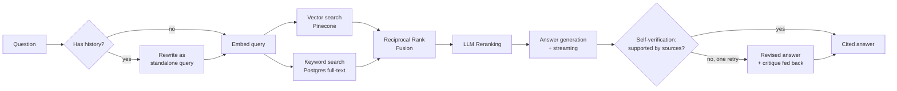

# Agentic RAG Assistant

A full-stack retrieval-augmented generation system where every answer traces back to its exact source. Built to go beyond a basic "embed and search" wrapper — hybrid retrieval, LLM reranking, and query rewriting for follow-ups, wrapped in a real product UI with live streaming and verifiable citations.

**Stack:** Node.js/Express · React (Vite) · TypeScript · Groq · Jina AI · Pinecone · Supabase

---

## Why this isn't just another RAG demo

Most RAG tutorials stop at "embed chunks, do a vector search, stuff into a prompt." That approach has a well-known failure mode: pure vector similarity misses exact matches (product names, numbers, specific phrases), and there's no check on whether the retrieved chunks actually answer the question. This project addresses both directly:

- **Hybrid retrieval** — vector search (Pinecone) and keyword search (Postgres full-text) run in parallel and get fused with Reciprocal Rank Fusion, so a chunk that's a strong match on *either* signal surfaces correctly
- **LLM reranking** — a single batched call re-judges the fused candidates for genuine relevance, not just similarity score, before anything reaches the answering model
- **Query rewriting** — follow-up questions ("what about the second one?") get expanded into standalone queries using conversation history before retrieval runs
- **Self-verification** — after an answer is generated, a separate check asks whether it's actually supported by the cited sources. If not, one corrected revision streams in as a visible replacement, with the specific problem fed back into the prompt — not a silent retry
- **Verifiable citations** — every claim in an answer links back to the exact source chunk, with the model's own citation graph reflected in the UI (used vs. merely-retrieved sources are shown separately)

## Architecture



## Key Features

**Retrieval & answering**
- Structure-aware document chunking (markdown-header-aware, word-window fallback for plain text/PDF)
- Hybrid search fused with RRF, LLM reranking with a rescue safety net for broad/overview questions
- Self-verification with a single visible revision pass — answers are checked against their own cited sources after generation
- Streaming responses via Server-Sent Events — answers appear token-by-token
- Cross-family model fallback (generation/utility calls automatically retry on a different model family if the primary is decommissioned - see `modelFallback.js`)

**Conversations**
- Multi-turn memory backed by Supabase, with auto-titled threads
- Per-conversation document scoping — pick exactly which uploaded document(s) a thread searches
- Export any conversation to a clean, portable Markdown file (with citations and verification notes preserved)
- Filter conversations by title (search box appears once there are enough to be worth filtering)

**Documents**
- Organize documents into folders, or leave them uncategorized — folders are a pure organizational layer, deleting one never deletes the documents inside it
- Filter documents by filename or by folder

**Citations**
- Inline citation badges that expand into source cards (excerpt, full text, relevance score, chunk index)
- Distinguishes sources the model actually cited from ones merely retrieved

**Frontend**
- Apple-inspired dual-theme UI (light/dark, zero flash on load) with Framer Motion throughout
- Command palette (Cmd/Ctrl+K) for quick navigation and conversation search
- Markdown rendering, skeleton loading states, fully responsive

## Tech Stack

| Layer | Technology |
|---|---|
| Backend | Node.js, Express |
| Frontend | React, Vite, TypeScript, Tailwind CSS, Framer Motion |
| Testing | Vitest + React Testing Library (frontend), standalone Node scripts (backend) |
| LLM | Groq (generation + reranking/rewriting/verification) |
| Embeddings | Jina AI (`jina-embeddings-v3`) |
| Vector store | Pinecone |
| Database | Supabase (Postgres) — documents, conversations, messages, full-text search index |
| UI primitives | Radix UI, `cmdk` |

## Project Structure

```
agentic-rag-assistant/
├── server/
│   ├── src/
│   │   ├── routes/       # documents, query, conversations (SSE streaming)
│   │   ├── services/     # chunking, embeddings, retrieval pipeline, reranking,
│   │   │                 # query rewriting, self-verification, RRF fusion, model resilience
│   │   ├── db/           # Supabase-backed stores (documents, conversations, chunks)
│   │   ├── workers/      # async ingestion pipeline
│   │   └── utils/        # standalone test suites for pure/testable logic
│   └── supabase/         # SQL schema + migrations
└── client/
    └── src/
        ├── components/   # chat, citations, documents, conversations, command palette
        ├── context/      # theme, documents, conversations state
        └── lib/          # API client (incl. SSE streaming), types
```

## Getting Started

### Prerequisites
Free-tier accounts for [Groq](https://console.groq.com/keys) (no credit card required), [Jina AI](https://jina.ai/embeddings/), [Pinecone](https://app.pinecone.io), and [Supabase](https://supabase.com) — no paid tier required anywhere.

### 1. Supabase setup
Run `server/supabase/schema.sql`, then `server/supabase/migration_002_hybrid_search.sql`, then `server/supabase/migration_003_self_verification.sql`, then `server/supabase/migration_004_document_folders.sql` in the Supabase SQL Editor.

### 2. Pinecone setup
Create an index named to match `PINECONE_INDEX_NAME`, with **dimension 768** and **cosine** metric.

### 3. Backend
```bash
cd server
npm install
cp .env.example .env   # fill in your API keys
npm start
```
Runs on `http://localhost:5000`.

### 4. Frontend
```bash
cd client
npm install
npm run dev
```
Open the printed local URL. The dev server proxies `/api/*` to the backend — no frontend env vars needed.

## Configuration

All configuration lives in `server/.env` (see `.env.example` for the full list with defaults). Notable ones:

| Variable | Purpose |
|---|---|
| `GROQ_API_KEY` | Single shared key for generation/reranking/rewriting/verification — Groq rate-limits per organization, not per key, so there's no benefit to splitting this |
| `JINA_API_KEY` | Embeddings key — kept on a separate provider from Groq since Groq doesn't have a reliably documented embeddings API |
| `ENABLE_HYBRID_SEARCH`, `ENABLE_RERANKING`, `ENABLE_QUERY_REWRITE`, `ENABLE_SELF_VERIFICATION` | Toggle any pipeline stage independently, no code changes needed |
| `RETRIEVAL_TOP_K`, `RETRIEVAL_CANDIDATE_POOL` | Tune how many chunks are considered vs. sent to the model |
| `GENERATION_MODEL_FALLBACK`, `UTILITY_MODEL_FALLBACK` | Automatic fallback models if a primary model is deprecated/unavailable |

## API Reference

| Endpoint | Method | Description |
|---|---|---|
| `/api/documents/upload` | POST | Upload a document (`.txt`/`.md`/`.pdf`), returns immediately with async processing status. Optional `folderId` form field |
| `/api/documents/:id/status` | GET | Poll ingestion status |
| `/api/documents` | GET | List all documents. Optional `?folderId=<id>` or `?folderId=none` filter |
| `/api/documents/:id` | DELETE | Remove a document and its vectors |
| `/api/documents/:id/folder` | PATCH | Move a document to a folder (or `{folderId: null}` to uncategorize) |
| `/api/folders` | GET/POST | List or create folders |
| `/api/folders/:id` | DELETE | Delete a folder (documents inside become uncategorized, not deleted) |
| `/api/query` | POST | Stateless Q&A, streamed via SSE |
| `/api/conversations` | POST/GET | Create or list conversation threads |
| `/api/conversations/:id` | GET/DELETE | Fetch or delete a thread |
| `/api/conversations/:id/messages` | POST | Ask a question in a thread, streamed via SSE |
| `/health` | GET | Service status, configured providers, and active pipeline configuration |

## Testing

The backend includes standalone test suites for all pure/testable logic — no API keys required to run:

```bash
cd server
npm run test:chunking      # chunking strategy correctness
npm run test:rrf           # Reciprocal Rank Fusion logic
npm run test:reranker      # reranker response parsing, including malformed model output
npm run test:citations     # citation extraction from answer text
npm run test:modelfallback # model deprecation fallback behavior
npm run test:verification  # self-verification response parsing, fail-open behavior
npm run test:prompt        # prompt construction, with/without conversation history
```

To check your actual API keys against the live Groq and Jina APIs (this one does need real keys in `.env`):
```bash
npm run diagnose:keys
```

The frontend has its own Vitest suite — pure-logic tests (citation parsing, Markdown export) plus component tests (Composer send behavior, MessageBubble citation/verification rendering) using React Testing Library. No mocking of the backend needed for any of these; components that depend on Context are tested for their own rendering logic, not integration with a live API:

```bash
cd client
npm test          # run once
npm run test:watch # watch mode while developing
```

## Known Limitations

- Retrieval uses only the current question's embedding — conversation history informs *generation* (via query rewriting before retrieval) but isn't otherwise used to re-rank results
- No authentication layer — not required for local/single-user use, would be needed before any public deployment
- Documents uploaded before `migration_002_hybrid_search.sql` need re-uploading to benefit from hybrid search (their chunks predate the keyword-search index)
- This project originally used Gemini for both embeddings and generation; it now uses Jina AI for embeddings and Groq for generation, after Gemini's newly-issued API keys started hitting a Google-side authentication rollout issue. If you have documents ingested under the old Gemini setup, **re-upload them** — Jina's embeddings live in a different vector space than Gemini's, so old vectors in Pinecone won't retrieve correctly against new Jina-embedded queries even though both happen to use 768 dimensions.

## Roadmap

- Evaluation harness — automated retrieval precision/recall and answer faithfulness scoring against a golden question set
- Production hardening — rate limiting, auth, structured observability

## License

MIT
