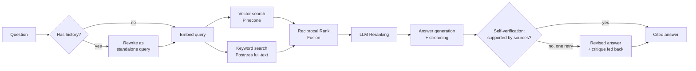

<p align="center">
  
</p>

<p align="center">
  
  
  = 18" />
  
  
</p>

# Agentic RAG Assistant

A full-stack retrieval-augmented generation system where every answer traces back to its exact source. Built to go beyond a basic "embed and search" wrapper — hybrid retrieval, LLM reranking, and query rewriting for follow-ups, wrapped in a real product UI with live streaming and verifiable citations.

**Stack:** Node.js/Express · React (Vite) · TypeScript · Groq · Jina AI · Pinecone · Supabase

<details>
<summary><strong>Table of contents</strong></summary>

- [Why this isn't just another RAG demo](#why-this-isnt-just-another-rag-demo)
- [Screenshots](#screenshots)
- [Architecture](#architecture)
- [Key Features](#key-features)
- [Tech Stack](#tech-stack)
- [Project Structure](#project-structure)
- [Getting Started](#getting-started)
- [Configuration](#configuration)
- [API Reference](#api-reference)
- [Testing](#testing)
- [Evaluation](#evaluation)
- [Deployment](#deployment)
- [Known Limitations](#known-limitations)
- [Roadmap](#roadmap)
- [License](#license)

</details>

---

## Why this isn't just another RAG demo

Most RAG tutorials stop at "embed chunks, do a vector search, stuff into a prompt." That approach has a well-known failure mode: pure vector similarity misses exact matches (product names, numbers, specific phrases), and there's no check on whether the retrieved chunks actually answer the question. This project addresses both directly:

- **Hybrid retrieval** — vector search (Pinecone) and keyword search (Postgres full-text) run in parallel and get fused with Reciprocal Rank Fusion, so a chunk that's a strong match on *either* signal surfaces correctly
- **LLM reranking** — a single batched call re-judges the fused candidates for genuine relevance, not just similarity score, before anything reaches the answering model
- **Query rewriting** — follow-up questions ("what about the second one?") get expanded into standalone queries using conversation history before retrieval runs
- **Self-verification** — after an answer is generated, a separate check asks whether it's actually supported by the cited sources. If not, one corrected revision streams in as a visible replacement, with the specific problem fed back into the prompt — not a silent retry
- **Verifiable citations** — every claim in an answer links back to the exact source chunk, with the model's own citation graph reflected in the UI (used vs. merely-retrieved sources are shown separately)

## Screenshots

<!--
  Add real screenshots here before sharing this repo widely - a live shot
  of the chat view (with citations expanded) and the document/folder
  sidebar are the two most convincing. Drop PNGs in docs/screenshots/ and
  reference them like:
  <p align="center"></p>
-->

## Architecture



## Key Features

**Retrieval & answering**
- Structure-aware document chunking (markdown-header-aware, word-window fallback for plain text/PDF)
- Hybrid search fused with RRF, LLM reranking with a rescue safety net for broad/overview questions
- Self-verification with a single visible revision pass — answers are checked against their own cited sources after generation
- Streaming responses via Server-Sent Events — answers appear token-by-token
- Cross-family model fallback (generation/utility calls automatically retry on a different model family if the primary is decommissioned - see `modelFallback.js`), plus a separate provider-level fallback (Mistral) if Groq itself is unreachable, not just a single model
- A golden-set evaluation harness (`npm run eval`) scoring retrieval precision, answer faithfulness (LLM-as-judge), and abstention accuracy against a fictional document designed so the model can't cheat with training-data knowledge

**Conversations**
- Multi-turn memory backed by Supabase, with auto-titled threads
- Per-conversation document scoping — pick exactly which uploaded document(s) a thread searches
- Export any conversation to a clean, portable Markdown file (with citations and verification notes preserved)
- Filter conversations by title (search box appears once there are enough to be worth filtering)

**Documents**
- Organize documents into folders, or leave them uncategorized — folders are a pure organizational layer, deleting one never deletes the documents inside it
- Filter documents by filename or by folder

**Citations**
- Inline citation badges that expand into source cards (excerpt, full text, relevance score, chunk index)
- Distinguishes sources the model actually cited from ones merely retrieved

**Frontend**
- Custom "Ledger" design system — a research-ledger/evidence-desk aesthetic (cool sage paper tones, verdigris + rust-sienna dual accents, Newsreader serif + Public Sans + JetBrains Mono) built deliberately away from the cream-and-one-accent look most AI-generated UIs default to; full light/dark theming with zero flash on load
- Citation badges styled as archive stamps (a signature element tied directly to the product's actual mechanic, not decoration) with spring-physics entrance animation
- Command palette (Cmd/Ctrl+K) for quick navigation and conversation search, with staggered result entrance
- Ambient animated background, staggered list/message entrance, page-transition choreography throughout via Framer Motion — all respecting `prefers-reduced-motion`
- Code-split so the landing page ships independently from the app shell (~108KB gzipped initial load vs. ~190KB before splitting)
- Fully responsive, including a proper mobile drawer sidebar

## Tech Stack

| Layer | Technology |
|---|---|
| Backend | Node.js, Express |
| Frontend | React, Vite, TypeScript, Tailwind CSS, Framer Motion |
| Testing | Vitest + React Testing Library (frontend), standalone Node scripts (backend) |
| LLM | Groq (generation + reranking/rewriting/verification), Mistral AI (optional provider-level fallback) |
| Embeddings | Jina AI (`jina-embeddings-v3`) |
| Vector store | Pinecone |
| Database | Supabase (Postgres) — documents, conversations, messages, full-text search index |
| UI primitives | Radix UI, `cmdk` |

## Project Structure

```
agentic-rag-assistant/
├── server/
│   ├── src/
│   │   ├── routes/       # documents, folders, query, conversations (SSE streaming)
│   │   ├── services/     # chunking, embeddings, retrieval pipeline, reranking,
│   │   │                 # query rewriting, self-verification, RRF fusion, model resilience
│   │   ├── db/           # Supabase-backed stores (documents, folders, conversations, chunks)
│   │   ├── workers/      # async ingestion pipeline
│   │   ├── utils/        # standalone test suites for pure/testable logic
│   │   ├── app.js        # builds the Express app (no side effects - safe to import in tests)
│   │   └── server.js     # actual boot entry point (app.js + app.listen())
│   ├── test/              # HTTP-level route tests (Express + supertest, DB layer mocked)
│   ├── eval/              # RAG evaluation harness (golden document + question set)
│   └── supabase/         # SQL schema + migrations
└── client/
    └── src/
        ├── components/   # chat, citations, documents, conversations, command palette
        ├── context/      # theme, documents, conversations state
        ├── lib/          # API client (incl. SSE streaming), types, export/citation logic
        └── test/         # Vitest unit + component tests
```

## Getting Started

### Prerequisites
Free-tier accounts for [Groq](https://console.groq.com/keys) (no credit card required), [Jina AI](https://jina.ai/embeddings/), [Pinecone](https://app.pinecone.io), and [Supabase](https://supabase.com) — no paid tier required anywhere.

### 1. Supabase setup
Run `server/supabase/schema.sql`, then `server/supabase/migration_002_hybrid_search.sql`, then `server/supabase/migration_003_self_verification.sql`, then `server/supabase/migration_004_document_folders.sql` in the Supabase SQL Editor.

### 2. Pinecone setup
Create an index named to match `PINECONE_INDEX_NAME`, with **dimension 768** and **cosine** metric.

### 3. Backend
```bash
cd server
npm install
cp .env.example .env   # fill in your API keys
npm start
```
Runs on `http://localhost:5000`.

### 4. Frontend
```bash
cd client
npm install
npm run dev
```
Open the printed local URL. The dev server proxies `/api/*` to the backend — no frontend env vars needed.

## Configuration

All configuration lives in `server/.env` (see `.env.example` for the full list with defaults). Notable ones:

| Variable | Purpose |
|---|---|
| `GROQ_API_KEY` | Single shared key for generation/reranking/rewriting/verification — Groq rate-limits per organization, not per key, so there's no benefit to splitting this |
| `JINA_API_KEY` | Embeddings key — kept on a separate provider from Groq since Groq doesn't have a reliably documented embeddings API |
| `MISTRAL_API_KEY` | Optional provider-level fallback if Groq is entirely unreachable — unset simply skips this, no code changes needed |
| `ENABLE_HYBRID_SEARCH`, `ENABLE_RERANKING`, `ENABLE_QUERY_REWRITE`, `ENABLE_SELF_VERIFICATION` | Toggle any pipeline stage independently, no code changes needed |
| `RETRIEVAL_TOP_K`, `RETRIEVAL_CANDIDATE_POOL` | Tune how many chunks are considered vs. sent to the model |
| `GENERATION_MODEL_FALLBACK`, `UTILITY_MODEL_FALLBACK` | Automatic fallback models if a primary model is deprecated/unavailable |

## API Reference

| Endpoint | Method | Description |
|---|---|---|
| `/api/documents/upload` | POST | Upload a document (`.txt`/`.md`/`.pdf`), returns immediately with async processing status. Optional `folderId` form field |
| `/api/documents/:id/status` | GET | Poll ingestion status |
| `/api/documents` | GET | List all documents. Optional `?folderId=<id>` or `?folderId=none` filter |
| `/api/documents/:id` | DELETE | Remove a document and its vectors |
| `/api/documents/:id/folder` | PATCH | Move a document to a folder (or `{folderId: null}` to uncategorize) |
| `/api/folders` | GET/POST | List or create folders |
| `/api/folders/:id` | DELETE | Delete a folder (documents inside become uncategorized, not deleted) |
| `/api/query` | POST | Stateless Q&A, streamed via SSE |
| `/api/conversations` | POST/GET | Create or list conversation threads |
| `/api/conversations/:id` | GET/DELETE | Fetch or delete a thread |
| `/api/conversations/:id/messages` | POST | Ask a question in a thread, streamed via SSE |
| `/health` | GET | Service status, configured providers, and active pipeline configuration |

## Testing

Every push and PR to `main` runs the full suite below via [GitHub Actions](.github/workflows/ci.yml) — backend and frontend jobs in parallel, no secrets required (see why in the workflow file's comments). To run the same checks locally:

The backend includes standalone test suites for all pure/testable logic — no API keys required to run:

```bash
cd server
npm run test:chunking      # chunking strategy correctness
npm run test:rrf           # Reciprocal Rank Fusion logic
npm run test:reranker      # reranker response parsing, including malformed model output
npm run test:citations     # citation extraction from answer text
npm run test:modelfallback # model deprecation fallback behavior
npm run test:verification  # self-verification response parsing, fail-open behavior
npm run test:prompt        # prompt construction, with/without conversation history
```

A second layer tests the HTTP route handlers themselves (Express + [supertest](https://github.com/ladjs/supertest)), covering request validation, status codes, and error-path behavior (e.g. a document delete that still succeeds even if the Pinecone cleanup call fails, or a conversation that only gets auto-titled on its first message, not every message). The DB and provider layers are mocked with `node:test`'s built-in `t.mock.method()` — no live Supabase/Pinecone/Groq calls, so like everything else here it runs green with zero secrets configured:

```bash
npm run test:routes
```

To check your actual API keys against the live Groq and Jina APIs (this one does need real keys in `.env`):
```bash
npm run diagnose:keys
```

The frontend has its own Vitest suite — pure-logic tests (citation parsing, Markdown export) plus component tests (Composer send behavior, MessageBubble citation/verification rendering) using React Testing Library. No mocking of the backend needed for any of these; components that depend on Context are tested for their own rendering logic, not integration with a live API:

```bash
cd client
npm test          # run once
npm run test:watch # watch mode while developing
```

## Evaluation

Everything above tests *code* - this tests whether the RAG pipeline is actually good at its job, which is a fundamentally different question that pure unit tests can't answer. It needs a running server and real provider keys (unlike every other test in this project, mocking the retrieval/generation here would make the "evaluation" measure nothing real), so it's a manual tool rather than a CI step:

```bash
cd server
npm run dev      # in one terminal - the eval harness talks to a live server
npm run eval     # in another terminal
```

It runs 14 golden questions against a small **fictional** document (`eval/golden-document.md` - an invented company, invented numbers) and scores three things:

- **Retrieval** - deterministic check for whether the expected facts actually made it into the *retrieved chunks*, independent of what the LLM did with them. A low score here means the problem is retrieval, not generation.
- **Faithfulness & completeness** - LLM-as-judge (Groq grades the system's own answer against what was retrieved). This is the same technique the app's own self-verification feature uses live, per-query - the eval harness just runs it offline, in batch, against a fixed known-answer set instead of one query at a time.
- **Abstention accuracy** - a third of the golden set is deliberately *unanswerable* from the document, including one trap question that presupposes a fact never stated. Correct behavior is declining to answer, not guessing.

The document is invented specifically so an LLM can't get questions right from its own training data - a real-world topic would make it impossible to tell whether the *system* is grounding its answers correctly or the *model* just already knew the answer. A full per-question report is written to `eval/last-report.json` after each run.

The judge uses `GENERATION_MODEL` by default (override with `EVAL_JUDGE_MODEL`), not the lighter `UTILITY_MODEL` - grading with several conditional criteria at once turned out to be a harder reasoning task than expected for a small/fast model, which tended to echo the prompt's example numbers verbatim instead of actually grading (a real bug caught by running this against a live server - every question scored an identical, suspicious 0%). The harness now also auto-flags that specific failure mode if it ever recurs, rather than silently reporting a degenerate result as if it were real.

## Deployment

Two services to deploy: the Node/Express backend and the static Vite/React frontend build. Free tiers work fine for a personal project.

### 1. Database (once, before either service)

Run all four `server/supabase/*.sql` files against your **production** Supabase project (same steps as local setup) — a separate Supabase project than the one you used for local dev, if you want to keep them independent.

### 2. Backend

Any Node host works (Render, Railway, Fly.io). Using Render as the example:
1. New Web Service → point at this repo → root directory `server`
2. Build command: `npm install`
3. Start command: `npm start`
4. Add every variable from `server/.env.example` in the host's environment variable settings — **not** the `.env` file itself, which is gitignored and never deployed
5. Note the resulting URL (e.g. `https://your-app.onrender.com`)

Free tiers on most of these hosts spin the server down after a period of inactivity and take a few seconds to wake back up on the next request — expected, not a bug, if the very first request after a while feels slow.

### 3. Frontend

Any static host works (Vercel, Netlify, Cloudflare Pages). Using Vercel as the example:
1. New Project → point at this repo → root directory `client`
2. Build command: `npm run build`, output directory: `dist`
3. **If the frontend and backend end up on separate domains** (the common case with this two-host setup), add one build-time environment variable: `VITE_API_BASE_URL=https://your-backend-url` (from step 2) — without this, the frontend's `/api/...` calls have nowhere to go, since Vite's local dev proxy only exists in development
4. If instead you're serving both from the same domain (e.g. the backend also serves the built frontend as static files, or your host rewrites `/api/*` to the backend), skip step 3 entirely — the default relative-path behavior already works

### 4. Lock down CORS (optional)

By default the backend accepts requests from any origin (fine for local dev and same-domain deploys). If the frontend is on a separate domain, set `ALLOWED_ORIGIN=https://your-frontend-url` in the backend's environment to restrict this. There's no authentication layer in this app either way (see Known Limitations below) — this is a defense-in-depth setting, not access control.

## Known Limitations

- Retrieval uses only the current question's embedding — conversation history informs *generation* (via query rewriting before retrieval) but isn't otherwise used to re-rank results
- No authentication layer — not required for local/single-user use, would be needed before any public deployment
- Documents uploaded before `migration_002_hybrid_search.sql` need re-uploading to benefit from hybrid search (their chunks predate the keyword-search index)
- This project originally used Gemini for both embeddings and generation; it now uses Jina AI for embeddings and Groq for generation, after Gemini's newly-issued API keys started hitting a Google-side authentication rollout issue. If you have documents ingested under the old Gemini setup, **re-upload them** — Jina's embeddings live in a different vector space than Gemini's, so old vectors in Pinecone won't retrieve correctly against new Jina-embedded queries even though both happen to use 768 dimensions.

## Roadmap

- Evaluation harness — automated retrieval precision/recall and answer faithfulness scoring against a golden question set
- Production hardening — rate limiting, auth, structured observability

## License

MIT
