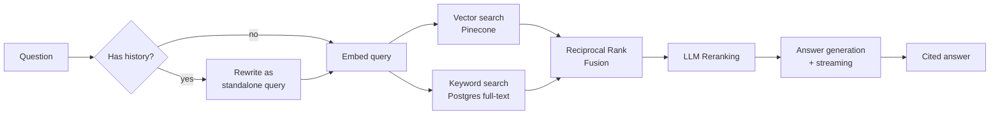

# Agentic RAG Assistant

A full-stack retrieval-augmented generation system where every answer traces back to its exact source. Built to go beyond a basic "embed and search" wrapper — hybrid retrieval, LLM reranking, and query rewriting for follow-ups, wrapped in a real product UI with live streaming and verifiable citations.

**Stack:** Node.js/Express · React (Vite) · TypeScript · Google Gemini · Pinecone · Supabase

---

## Why this isn't just another RAG demo

Most RAG tutorials stop at "embed chunks, do a vector search, stuff into a prompt." That approach has a well-known failure mode: pure vector similarity misses exact matches (product names, numbers, specific phrases), and there's no check on whether the retrieved chunks actually answer the question. This project addresses both directly:

- **Hybrid retrieval** — vector search (Pinecone) and keyword search (Postgres full-text) run in parallel and get fused with Reciprocal Rank Fusion, so a chunk that's a strong match on *either* signal surfaces correctly
- **LLM reranking** — a single batched call re-judges the fused candidates for genuine relevance, not just similarity score, before anything reaches the answering model
- **Query rewriting** — follow-up questions ("what about the second one?") get expanded into standalone queries using conversation history before retrieval runs
- **Verifiable citations** — every claim in an answer links back to the exact source chunk, with the model's own citation graph reflected in the UI (used vs. merely-retrieved sources are shown separately)

## Architecture



## Key Features

**Retrieval & answering**
- Structure-aware document chunking (markdown-header-aware, word-window fallback for plain text/PDF)
- Hybrid search fused with RRF, LLM reranking with a rescue safety net for broad/overview questions
- Streaming responses via Server-Sent Events — answers appear token-by-token
- Multi-key Gemini distribution (separate keys for embedding/generation/utility calls, with automatic fallback if a model becomes unavailable)

**Conversations**
- Multi-turn memory backed by Supabase, with auto-titled threads
- Per-conversation document scoping — pick exactly which uploaded document(s) a thread searches

**Citations**
- Inline citation badges that expand into source cards (excerpt, full text, relevance score, chunk index)
- Distinguishes sources the model actually cited from ones merely retrieved

**Frontend**
- Apple-inspired dual-theme UI (light/dark, zero flash on load) with Framer Motion throughout
- Command palette (Cmd/Ctrl+K) for quick navigation and conversation search
- Markdown rendering, skeleton loading states, fully responsive

## Tech Stack

| Layer | Technology |
|---|---|
| Backend | Node.js, Express |
| Frontend | React, Vite, TypeScript, Tailwind CSS, Framer Motion |
| LLM | Google Gemini (embeddings + generation + reranking/rewriting) |
| Vector store | Pinecone |
| Database | Supabase (Postgres) — documents, conversations, messages, full-text search index |
| UI primitives | Radix UI, `cmdk` |

## Project Structure

```
agentic-rag-assistant/
├── server/
│   ├── src/
│   │   ├── routes/       # documents, query, conversations (SSE streaming)
│   │   ├── services/     # chunking, embeddings, retrieval pipeline, reranking,
│   │   │                 # query rewriting, RRF fusion, model resilience
│   │   ├── db/           # Supabase-backed stores (documents, conversations, chunks)
│   │   ├── workers/      # async ingestion pipeline
│   │   └── utils/        # standalone test suites for pure/testable logic
│   └── supabase/         # SQL schema + migrations
└── client/
    └── src/
        ├── components/   # chat, citations, documents, conversations, command palette
        ├── context/      # theme, documents, conversations state
        └── lib/          # API client (incl. SSE streaming), types
```

## Getting Started

### Prerequisites
Free-tier accounts for [Google AI Studio](https://aistudio.google.com/apikey), [Pinecone](https://app.pinecone.io), and [Supabase](https://supabase.com) — no paid tier required.

### 1. Supabase setup
Run `server/supabase/schema.sql`, then `server/supabase/migration_002_hybrid_search.sql` in the Supabase SQL Editor.

### 2. Pinecone setup
Create an index named to match `PINECONE_INDEX_NAME`, with **dimension 768** and **cosine** metric.

### 3. Backend
```bash
cd server
npm install
cp .env.example .env   # fill in your API keys
npm start
```
Runs on `http://localhost:5000`.

### 4. Frontend
```bash
cd client
npm install
npm run dev
```
Open the printed local URL. The dev server proxies `/api/*` to the backend — no frontend env vars needed.

## Configuration

All configuration lives in `server/.env` (see `.env.example` for the full list with defaults). Notable ones:

| Variable | Purpose |
|---|---|
| `GEMINI_API_KEY_*` | Optional per-role key distribution (embedding/generation/utility) — falls back to a single `GEMINI_API_KEY` if unset |
| `ENABLE_HYBRID_SEARCH`, `ENABLE_RERANKING`, `ENABLE_QUERY_REWRITE` | Toggle any pipeline stage independently, no code changes needed |
| `RETRIEVAL_TOP_K`, `RETRIEVAL_CANDIDATE_POOL` | Tune how many chunks are considered vs. sent to the model |
| `GENERATION_MODEL_FALLBACK`, `UTILITY_MODEL_FALLBACK` | Automatic fallback models if a primary model is deprecated/unavailable |

## API Reference

| Endpoint | Method | Description |
|---|---|---|
| `/api/documents/upload` | POST | Upload a document (`.txt`/`.md`/`.pdf`), returns immediately with async processing status |
| `/api/documents/:id/status` | GET | Poll ingestion status |
| `/api/documents` | GET | List all documents |
| `/api/documents/:id` | DELETE | Remove a document and its vectors |
| `/api/query` | POST | Stateless Q&A, streamed via SSE |
| `/api/conversations` | POST/GET | Create or list conversation threads |
| `/api/conversations/:id` | GET/DELETE | Fetch or delete a thread |
| `/api/conversations/:id/messages` | POST | Ask a question in a thread, streamed via SSE |
| `/health` | GET | Service status, key distribution, and active pipeline configuration |

## Testing

The backend includes standalone test suites for all pure/testable logic — no API keys required to run:

```bash
cd server
npm run test:chunking      # chunking strategy correctness
npm run test:rrf           # Reciprocal Rank Fusion logic
npm run test:reranker      # reranker response parsing, including malformed model output
npm run test:citations     # citation extraction from answer text
npm run test:modelfallback # model deprecation fallback behavior
npm run test:thinking      # thinking-token config per model family
npm run test:prompt        # prompt construction, with/without conversation history
```

## Known Limitations

- Retrieval uses only the current question's embedding — conversation history informs *generation* (via query rewriting before retrieval) but isn't otherwise used to re-rank results
- No authentication layer — not required for local/single-user use, would be needed before any public deployment
- Documents uploaded before `migration_002_hybrid_search.sql` need re-uploading to benefit from hybrid search (their chunks predate the keyword-search index)

## Roadmap

- Agentic self-verification — a post-generation check that re-retrieves if the answer isn't well-supported by its cited sources
- Evaluation harness — automated retrieval precision/recall and answer faithfulness scoring against a golden question set
- Production hardening — rate limiting, auth, structured observability

## License

MIT
